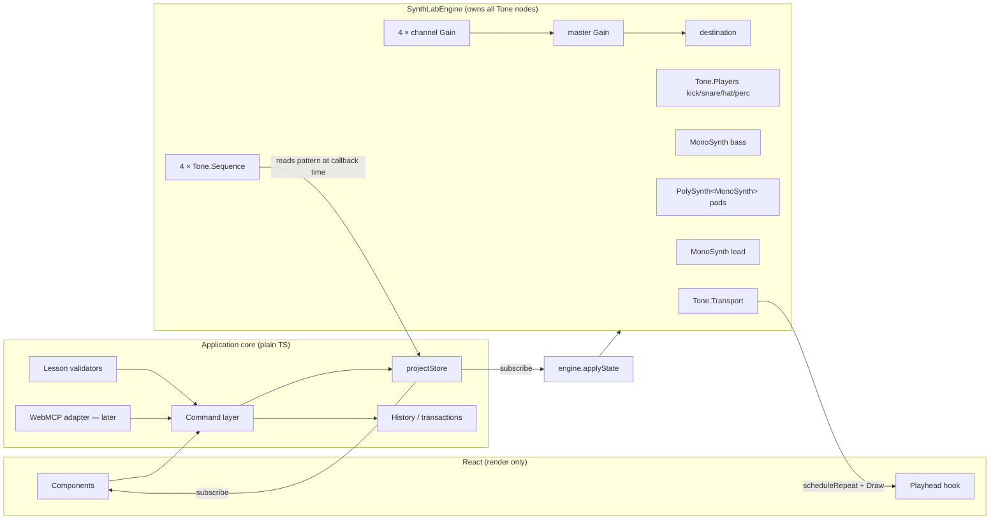

# Synth Lab Implementation Plan

**Status:** Research/architecture spike complete — ready for implementation
**Date:** 2026-08-07
**Author:** Technical research & architecture agent
**Companion documents:** `synth-lab-product-brief.md` (repo root), Figma `Soft Arcade Synth Lab`, Figma `Soft Arcade Design System V1`

---

## 1. Executive summary

Synth Lab is a four-track (Drums / Bass / Pads / Lead) loop-based groovebox that teaches subtractive synthesis, built as a route inside the existing SoftArcade Next.js app.

The recommended architecture:

- **Tone.js 15.1.22** over the Web Audio API, with **one shared `Tone.Transport`** as the authoritative musical clock and four `Tone.Sequence`s (one per track) that read pattern state live at callback time.
- A **`SynthLabEngine` class** owns every audio node, exactly like Near Miss's `NearMissGameLoop` owns the game loop. React never touches Tone objects.
- A **plain-TypeScript project store** (module singleton + `useSyncExternalStore`) owns project state; a **semantic command layer** is the only way to mutate it. Commands produce **before/after transactions** that power undo and, later, WebMCP.
- All of the hard requirements were **proven in a working spike** (see §5): shared transport, sample-based drums, mono bass with filter envelope, polyphonic chord pads, live parameter/pattern/tempo edits during playback, gesture-gated audio start.

The design is fully specified in the `Soft Arcade Synth Lab` Figma file: 16-step one-bar loop in C minor, scale-locked note grids, 11 new Synth Lab components, dual perceptual/technical labels, horizontal sliders, coach rail, inline agent cards. The file's `11 — Handoff` page enumerates behavior contracts this plan folds in verbatim.

---

## 2. Sources of truth

| Source | Where | What it owns |
| --- | --- | --- |
| Product brief | `synth-lab-product-brief.md` (repo root) | Product contract, MVP scope, learning model, agent behavior, non-goals |
| Synth Lab product design | Figma **Soft Arcade Synth Lab** — `https://www.figma.com/design/IepLZXDspQ6ma22kDlQVWx/` | Final interaction/layout design (brief §30: Figma wins on visual/layout detail) |
| Design system | Figma **Soft Arcade Design System V1** — `https://www.figma.com/design/PtTVVeJV510W5GMowTEbMu/` + `docs/design-system/current-design-audit.md` + root `AGENTS.md` | Tokens, typography, shared components, provenance rules |
| Codebase | this repo | Framework, conventions, deployment |

### Synth Lab Figma file — page map (inspected 2026-08-07)

| Page (node id) | Contents relevant to implementation |
| --- | --- |
| `05 — Product Architecture` (2:6) | Workspace anatomy, 9 numbered regions, persistence/ownership table, decisions A1/B2/C3/D3/E2 |
| `06 — Components` (2:7) | The 11 Synth Lab component sets with variants + descriptions (node ids in §15) |
| `07 — Final / Desktop` (2:8) | Frames: `Lesson active — Playing` (32:5), `First entry — audio not started` (48:176, includes Start Gate 48:459), `Free play` (50:374) |
| `08 — Final / Responsive` (2:9) | `Narrow 834` (60:2), `Mobile 390` (65:416), responsive strategy annotation (69:289) |
| `09 — Interaction States` (2:10) | Transport states, agent lifecycle (unavailable/connected/working/complete/error), reset dialogs, undo receipt, keyboard/focus/disabled treatments, note-entry rules |
| `11 — Handoff` (2:12) | Build/reuse inventory, illustrative-vs-real list, WebMCP tool→UI map, behavior contracts, open engineering decisions |
| `12 — Design Review` (2:13) | Decisions A1–G1 with rejected alternatives, brief-§25 state coverage, flagged conflicts |

Pages 00–04 and 10 (cover, brief, experience map, flows, explorations, prototype) are context; do not re-derive requirements from them when 05–12 answer the question.

---

## 3. Current SoftArcade architecture

Facts verified in the repo (2026-08-07):

- **Framework:** Next.js `^16.2.5` App Router, React `19.2`, TypeScript `5.8` strict, path alias `@/* → src/*`. Node ≥ 20.9.
- **Styling:** No Tailwind. Global tokens as CSS custom properties in `src/app/globals.css` (`--panel`, `--accent`, `--focus-ring`, `--font-size-*`, etc.); per-game CSS Modules (`src/games/*/styles.module.css`). Figtree via `next/font/google` on `<html>` (`--font-figtree`).
- **Game pattern:** `src/games/registry.ts` (`GameDefinition`) → `/games/[slug]` → `GamePageShell` (heading + stage + leaderboard rail + instructions). **Synth Lab does not use this shell** — the approved design has its own full-width layout and a top-level nav entry (see §15).
- **Engine precedent:** Near Miss (`src/games/near-miss/`) separates an imperative engine (`engine/gameLoop.ts`, plain class, rAF-driven, snapshot objects) from a `"use client"` React shell (`NearMissGame.tsx`) that renders snapshots. Synth Lab's audio engine follows the same shape.
- **State management:** No state library anywhere. React hooks + imperative engine classes. **Do not add Redux/Zustand** — a module store with `useSyncExternalStore` matches the codebase.
- **Persistence:** `localStorage` with `soft-arcade-*` keys (`src/lib/arcadeName.ts`, Near Miss best score). No accounts.
- **Analytics:** PostHog via `instrumentation-client.ts` and per-game capture calls.
- **Testing/linting:** **None exists** — no test runner, no ESLint config. `npm run build` (`next build`) is the only verification gate. See §18.
- **Deployment:** Cloudflare Pages (`npm run deploy:pages`) + a separate Cloudflare Worker with D1 for leaderboards. Static assets live in `public/`.
- **Responsive conventions:** 900px (layout collapse), 640px (chrome/nav collapse), plus game-owned 720/560/480px. 16px page gutter via `width: min(--max-width, calc(100% - 32px))`.
- **Audio:** **No audio code exists anywhere in the repo.** Synth Lab introduces it.
- **Browser support:** Evergreen desktop Chrome/Safari/Firefox + mobile Safari/Chrome (implied by current games; no explicit browserslist).

---

## 4. Technical decisions

**`DECISION — Audio engine: Tone.js 15.1.22` (npm `tone`, pinned).** Rationale in §5/§6. Raw Web Audio rejected: we would re-implement a musical transport, look-ahead scheduler, envelope/filter-envelope primitives, and polyphonic voice allocation that Tone.js already provides and that the spike verified. No other library evaluated — nothing else offers a musical transport + synth primitives at this maturity, and the brief already prefers Tone.js.

**`DECISION — Musical clock: the single global Tone.Transport`** (`Tone.getTransport()`), `loop = true`, `loopStart 0`, `loopEnd "1m"`, 4/4, 16 steps of `"16n"`. The audio clock is authoritative; React renders a non-authoritative playhead via `transport.scheduleRepeat` + `Tone.getDraw()` (§9).

**`DECISION — State ownership: a plain-TS project store, mutated only through commands.`** `projectStore` (module singleton, immutable snapshots, `useSyncExternalStore` for React). The engine subscribes to the store; the UI never calls the engine directly for state changes. Transport *position* is deliberately NOT in this store (§9, §11).

**`DECISION — Engine boundary: SynthLabEngine class`** owning all Tone nodes (§6). Constructed once after the Start gesture, disposed on route unmount. React components receive engine access only for non-state concerns (playhead subscription, audition).

**`DECISION — Command layer: typed semantic commands`** (`toggleDrumStep`, `setStepNote`, `setSynthParam`, …) shared by UI, lessons, undo, and later WebMCP (§10). Every mutating command records a before/after transaction (§12).

**`DECISION — Undo: inverse-patch transactions, one per user gesture / one per agent tool call`**, single shared stack, depth 100 (§12).

**`DECISION — Persistence: localStorage`,** keys `soft-arcade-synth-lab-project-v1` and `soft-arcade-synth-lab-progress-v1`, debounced writes, versioned schema (§13).

**`DECISION — Drum sounds: four in-house CC0 samples`** (kick/snare/hat/perc) committed to `public/audio/synth-lab/` as 44.1 kHz 16-bit mono WAV, loaded through `Tone.Players` during the Start gate (§8-Drums, §5 asset strategy).

**`DECISION — Route: /synth-lab`, code under `src/synth-lab/`**, NOT a `games/registry.ts` entry — the approved design gives Synth Lab its own nav item and its own layout without the game shell/leaderboard rail (§15, §20).

**`DECISION — Parameter registry with explicit ranges/curves`** resolves the handoff's open item 1 (§8 table). Bass Brightness: 100 Hz–8 kHz, logarithmic.

**`DECISION — Voices ceiling: Mono / 2 / 4 as designed`**, `PolySynth.maxPolyphony = 8` (voice count + release tails — spike measured 6 active voices during a 3-note chord crossfade). The Figma label needs no change (handoff open item 2).

**`DECISION — Reduced motion: playhead steps discretely per 16th (no sweep/transition), agent dot static`** (handoff open item 4 — engineering default; verify in polish phase).

**`DECISION — Testing: add Vitest for pure-logic unit tests only`** — the only new dev tooling this feature introduces (§18).

---

## 5. Research findings

Only findings that shape implementation. Primary sources:

- Tone.js docs: `https://tonejs.github.io/docs/15.1.22/` (Transport, Sequence, MonoSynth, PolySynth, Players, Draw)
- Tone.js performance wiki: `https://github.com/Tonejs/Tone.js/wiki/Performance`
- Web Audio API: `https://developer.mozilla.org/en-US/docs/Web/API/Web_Audio_API`
- Autoplay policy: `https://developer.chrome.com/blog/autoplay/`
- WebMCP imperative API: `https://developer.chrome.com/docs/ai/webmcp/imperative-api`

Findings:

1. **Tone.js 15.1.22 is the current stable release** (`tone` on npm; a `tone@next` 15.5.x dev line exists — do not use it).
2. **`Tone.MonoSynth` is exactly the brief's teaching model in one class:** oscillator + amp ADSR + low-pass filter + filter envelope (`filterEnvelope.baseFrequency` = cutoff floor, `.octaves` = envelope amount). Bass and Lead need no custom DSP.
3. **`Tone.PolySynth(Tone.MonoSynth, …)` compiles and runs** — voices share the same patch model as Bass, satisfying "reuse the same mental model" (brief §8.4). `set()` propagates live to all voices. `maxPolyphony` caps allocation.
4. **`Tone.Sequence` callbacks receive sample-accurate `time`;** scheduling happens in a look-ahead worker (default `lookAhead` 0.1 s). Reading mutable pattern state inside the callback makes edits audible on the next step with zero re-scheduling — verified in the spike.
5. **Tempo is a signal:** `transport.bpm.rampTo(140, 0.1)` changes tempo click-free during playback; sequences stay locked because they are transport-relative.
6. **UI sync:** never touch the DOM in transport callbacks (they run off the rAF loop); use `Tone.getDraw().schedule()` to defer visual updates to the nearest animation frame.
7. **Autoplay:** every browser suspends the AudioContext until a user gesture. `await Tone.start()` inside the Start-gate click handler resumes it. On iOS the gesture must be a real user event (the design's explicit Start action satisfies this). Page backgrounding on iOS can re-suspend the context — listen for `visibilitychange`/`statechange` and surface the transport as stopped rather than pretending audio continues.
8. **Mobile:** decoding many/large buffers can crash constrained devices — four short mono drum samples (< 100 KB total) is well within budget. `ConvolverNode`/HRTF panners are the expensive nodes — MVP uses neither.
9. **WebMCP (July 2026):** `document.modelContext.registerTool({ name, description, inputSchema, execute, annotations })` — note **`navigator.modelContext` is deprecated as of Chrome 150**; feature-detect both. Origin-trial status; tools return string/content results; `readOnlyHint` annotation exists for the `get_*` tools. The app must be fully functional without it (brief §14).

### Spike (throwaway, validated 2026-08-07)

Two artifacts, both isolated in the session scratchpad and **not** committed:

1. **Compile-level contract** — a strict-TS file exercising every API this plan relies on (`PolySynth(Tone.MonoSynth)`, `filterEnvelope.baseFrequency`, `Players.player().start(time)`, `Sequence` + live pattern reads, `bpm.rampTo`, `Draw.schedule`, full disposal) type-checked clean against real `tone@15.1.22` typings.
2. **Runtime smoke test in desktop Chrome** — one transport, four synchronized sources (sample Players, MonoSynth bass, PolySynth(MonoSynth) pads, MonoSynth lead), gesture-gated start. Measured results: context `running` after gesture; all 16 steps fired and looped; mid-playback edits (pattern write, cutoff change, envelope `set()`, PolySynth `set()`, BPM ramp 112→140) all audible-path-applied without exceptions; `pads.activeVoices` peaked at 6 during chord crossfade.

Anything in §6–§9 marked "verified" refers to this spike. No spike code remains in the repo.

---

## 6. Audio architecture



**`SynthLabEngine` responsibilities**

- Create/own every Tone node; nothing else may construct or hold one.
- `start()` (after `Tone.start()` resolves), `play()`, `stop()`, `dispose()`.
- `applyState(project, prevProject)` — diff-based: only touched parameters hit Tone (`bass.filterEnvelope.baseFrequency = x`, `pads.set({...})`, `channel.gain`, `bpm.rampTo`). Patterns need **no** engine call — sequences read the store's current snapshot inside their callbacks (verified).
- Playhead publication: one `transport.scheduleRepeat("16n")` computes the step index and `Draw.schedule`s it into a tiny `playheadStore` (separate from `projectStore`, §9/§11).
- Audition support for A/B: apply a temporary patch directly to nodes without going through the store, restore on release (`audition_change` must not create history — Figma handoff contract).
- Preload drum buffers during the Start gate; expose per-sample load status.

**Not** engine responsibilities: pattern semantics (one-note-per-column etc. live in the command layer), lesson logic, history, persistence.

---

## 7. Musical / domain data model

Canonical model (in `src/synth-lab/state/types.ts`). Musical meaning lives here, never in component state. Values are semantic (scale-degree indices, chord ids) so the scale lock is structural, matching the Figma behavior contract "the scale is a lock, not a suggestion."

```ts
export type TrackId = "drums" | "bass" | "pads" | "lead";
export type DrumLaneId = "kick" | "snare" | "hat" | "perc";
export type DrumStep = "off" | "on" | "accent";          // Step component: Off / On / Accent
export type Waveform = "sine" | "triangle" | "sawtooth" | "square";
export const STEP_COUNT = 16;                              // one bar, 16 × 16n (Figma: fixed)

// C minor, one octave — the only scale in MVP (Figma decision G1)
// Row index 0 = lowest row. Bass rows C1..C2, Lead rows C3..C4.
export const SCALE_DEGREES = ["C", "D", "Eb", "F", "G", "Ab", "Bb", "C8va"] as const;

// Pads rows, bottom→top in Figma: Fm, Eb, Ab, Cm — stored by id with fixed voicings
export type ChordId = "Cm" | "Ab" | "Eb" | "Fm";
export const CHORD_VOICINGS: Record<ChordId, string[]> = {
  Cm: ["C3", "Eb3", "G3"], Ab: ["Ab2", "C3", "Eb3"],
  Eb: ["Eb3", "G3", "Bb3"], Fm: ["F3", "Ab3", "C4"],
};

export interface DrumPattern  { kind: "drums";  lanes: Record<DrumLaneId, DrumStep[]>; }
export interface NotePattern  { kind: "notes";  steps: (number | null)[]; }  // scale-row 0–7; null = rest
export interface ChordPattern { kind: "chords"; steps: (ChordId | null)[]; } // non-null = chord START;
// "Held" cells are DERIVED at render/playback time — never stored (Figma handoff contract)

export interface AmpEnvelope { attack: number; decay: number; sustain: number; release: number; } // s, s, 0–1, s
export interface SynthPatch {
  waveform: Waveform;
  octaveOffset: -1 | 0 | 1;              // relative to the track's home register
  ampEnv: AmpEnvelope;
  cutoffHz: number;                       // low-pass cutoff floor ("Brightness")
  resonance: number;                      // 0–1 UI value → mapped to filter Q ("Sharpness")
  filterEnvAmount: number;                // octaves above cutoffHz (0–4) — teaches filter movement
  voices: 1 | 2 | 4;                      // pads/lead; bass is architecturally 1
}

export interface Track<P> {
  id: TrackId; muted: boolean; level: number /* 0–1 → dB in engine */;
  pattern: P; patch: SynthPatch | null;   // null for drums (samples, not synthesis)
}

export interface Project {
  schemaVersion: 1;
  tempoBpm: number;                       // 60–180, default 112 (Figma)
  masterLevel: number;                    // 0–1
  tracks: {
    drums: Track<DrumPattern>; bass: Track<NotePattern>;
    pads: Track<ChordPattern>; lead: Track<NotePattern>;
  };
}

export interface SynthLabState {
  project: Project;
  selectedTrackId: TrackId;               // UI-meaningful, persisted, NOT in history
  transportStatus: "idle" | "playing";    // idle = stopped; audio-not-started is a UI gate, not state here
  lessons: LessonProgress;
  agentActivity: AgentAction[];           // display log (history owns reversibility)
}

export interface LessonProgress {
  activeChallengeId: string | null;       // null = Free Play
  completed: string[];                    // challenge ids
  concepts: Record<"oscillators"|"envelopes"|"filters"|"polyphony"|"recipes", boolean>;
}

export interface AgentAction {           // brief §22; rendered by Agent Action Card
  id: string; timestamp: number; trackId: TrackId | null;
  changes: { path: string; label: string; before: unknown; after: unknown;
             formattedBefore: string; formattedAfter: string }[];
  reason?: string; transactionId: string; // ties to the history entry Undo reverses
  status: "working" | "applied" | "error"; error?: string;
}
```

The default project is the **prebuilt jam** (brief §26): the exact pattern content shown in Figma 07 frames is representative, not prescriptive — author a musically coherent 16-step jam in C minor at 112 BPM during Phase 2/3 and keep it in `src/synth-lab/state/defaultProject.ts`.

---

## 8. Four-track implementation model

Shared trigger note derivation: `noteName(rowIndex, patch) = SCALE_DEGREES[row] at trackBaseOctave + patch.octaveOffset`. Bass base octave 1 (rows C1–C2), Lead base octave 3 (rows C3–C4) — exactly the Figma row labels.

### Drums (`Tone.Players`)

- Four lanes — kick, snare, hat, perc — matching Note Grid `Track=Drums` (Kick / Snare / Hat / Perc). Any number can fire in one column (Figma note-entry rule).
- Step cycle on tap: off → on → accent → off (Step component states). Accent = 0 dB, normal = −6 dB on the lane player at trigger time (spike-verified pattern).
- Samples: `public/audio/synth-lab/{kick,snare,hat,perc}.wav`, 44.1 kHz 16-bit mono, < 1 s each. **Create in-house** (render offline with a script or any synth, export WAV) so licensing is unambiguous — do not pull commercial packs. If a CC0 source is preferred, document its origin in `public/audio/synth-lab/README.md`.
- Preload during the Start gate (`Tone.Players` `onload`); the gate's Start button enables when buffers are ready (design already has the gate — no new UI state needed beyond a loading treatment on the button).
- **Failure:** if a sample fails to load, the lane renders normally but silent, and the gate surfaces a non-blocking "some sounds failed to load" note; retries on next visit. Never block the product on one 404.
- Mute/level: per-track `Tone.Gain` channel node — identical for all four tracks.
- Drum track has no `SynthPatch` and no synth editor (Figma: "pattern-only by design").

### Bass (`Tone.MonoSynth`)

- One `MonoSynth`: oscillator (4 waveforms) + amp ADSR + `lowpass` filter + filter envelope. Monophony is architectural — a MonoSynth cannot overlap notes.
- One note per column **enforced in the command layer** (`setStepNote` replaces any existing note in that column) — Figma: "a state rule, not a UI rule."
- Step → pitch: row index → C-minor degree at octave 1 + `octaveOffset`. Notes trigger `triggerAttackRelease(note, "16n", time)`.
- Parameter registry (resolves handoff open item 1 — all sliders are defined here, UI never invents ranges):

| Param (perceptual · technical) | Model field | Range | Curve | Display |
| --- | --- | --- | --- | --- |
| Brightness · Filter cutoff (low-pass) | `cutoffHz` | 100 Hz – 8 kHz | log | `4.8 kHz` / `720 Hz` |
| Sharpness · Resonance | `resonance` | 0–1 → Q 0.5–12 | linear UI, mapped | `18%` |
| Punch · Amp attack | `ampEnv.attack` | 1 ms – 2 s | log | `5 ms` |
| Length · Amp decay | `ampEnv.decay` | 10 ms – 2 s | log | `140 ms` |
| Sustain (More) | `ampEnv.sustain` | 0–1 | linear | `18%` |
| Release (More) | `ampEnv.release` | 10 ms – 4 s | log | `320 ms` |
| Sweep · Filter envelope amount (More) | `filterEnvAmount` | 0–4 oct | linear | `2.0 oct` |
| Octave (More) | `octaveOffset` | −1/0/+1 | discrete | `+1` |

- Engine mapping: `cutoffHz → filterEnvelope.baseFrequency`, `filterEnvAmount → filterEnvelope.octaves`, `resonance → filter.Q`. All live-settable without rebuilding nodes (verified).

### Pads (`Tone.PolySynth(Tone.MonoSynth)`)

- Same patch model as Bass — one editor implementation serves both (decision: reuse mental model, brief §8.4).
- Chord steps store a `ChordId` at the start column only. **Held is derived**: a chord sounds until the next chord start. Playback: on a chord-start step, `pads.releaseAll(time)` then `pads.triggerAttack(voicing, time)` (spike-verified). On `stop`, `releaseAll()`.
- `voices` control (Mono / 2 / 4, reusing the Difficulty Tabs pattern): trims the triggered voicing to its first N notes (1 → root only, 2 → root+third, 4 → full voicing; MVP voicings are 3 notes, so "4" plays all). This makes mono-vs-poly audibly demonstrable with one control — the polyphony lesson's A/B.
- `maxPolyphony = 8` (3-note chord + release tails measured at 6 active voices; 8 gives headroom without runaway CPU).
- Default patch: slow attack/release (pad character per brief §8.3).

### Lead (`Tone.MonoSynth`, poly-capable via the same voices control)

- Rows C3–C4. Same command (`setStepNote`) and same one-note-per-column rule as Bass — the grid is identical apart from register.
- Engine holds a MonoSynth for the mono case; if the design's mono/poly comparison lesson targets Lead, swap trigger routing to a small PolySynth the same way Pads works. **MVP keeps Lead mono** (Figma editor header: "MONO · ONE NOTE AT A TIME" on note tracks; the polyphony lesson lives on Pads). The patch model already carries `voices` so no schema change is needed if this evolves.
- Reuses the Bass editor component wholesale — only the parameter defaults and register differ.

---

## 9. Sequencing and timing

- **BPM source of truth:** `project.tempoBpm` in the store; engine mirrors it to `transport.bpm` (`rampTo(x, 0.1)` — click-free, verified). UI reads the store, never the transport.
- **Transport position source of truth:** `Tone.Transport` only. It is *deliberately absent* from `projectStore` — position changes ~9×/s at 112 BPM and would churn React state and persistence.
- **Loop:** 1 bar, 4/4, `loopEnd "1m"`, 16 steps at `"16n"`. Fixed in MVP (Figma: fixed 16 columns).
- **Scheduling:** four `Tone.Sequence`s (per track), each `start(0)` and synced to the transport. Callbacks receive sample-accurate `time` and **read the current store snapshot** to decide what to trigger. This is the whole edit-during-playback story: no re-scheduling, no sequence rebuilds, an edit is audible the next time its step comes around (verified).
- **UI playhead:** one `transport.scheduleRepeat("16n")` → `Tone.getDraw().schedule(() => playheadStore.set(step))`. `playheadStore` is a second tiny external store; only step cells and the transport loop indicator subscribe. React is never the clock; CSS transitions on the playhead are decoration (and disabled under reduced motion — playhead steps discretely instead).
- **Tempo change during playback:** allowed, ramped, sequences stay locked (transport-relative). No special casing.
- **Start/stop/reset:** `play` → `transport.start()` (position resumes from loop start); `stop` → `transport.stop()` + `pads.releaseAll()` + playhead cleared. Stop resets position to loop start — matching the design's loop-progress (not scrub-bar) transport. There is no pause in the design.
- **Synchronization of all four tracks:** they share the one transport and the one look-ahead scheduler; there is nothing to synchronize manually. Never create a second Transport/Context.
- **Forbidden:** `setInterval`/`requestAnimationFrame`/React renders as a musical clock; DOM work inside transport callbacks (use Draw); `Tone.Transport` access from components (engine-only).

---

## 10. Application command layer

`src/synth-lab/state/commands.ts`. One entry point:

```ts
dispatch(command: SynthLabCommand, origin: CommandOrigin): CommandResult
// origin: "user" | "lesson" | "agent" — recorded on the transaction

type SynthLabCommand =
  | { type: "play" } | { type: "stop" }
  | { type: "setTempo"; bpm: number }
  | { type: "setMasterLevel"; level: number }
  | { type: "selectTrack"; trackId: TrackId }
  | { type: "cycleDrumStep"; lane: DrumLaneId; step: number }          // off→on→accent→off
  | { type: "setDrumStep"; lane: DrumLaneId; step: number; value: DrumStep } // agent/lesson-friendly
  | { type: "setStepNote"; trackId: "bass" | "lead"; step: number; row: number | null } // null clears; replaces existing
  | { type: "setStepChord"; step: number; chord: ChordId | null }
  | { type: "setTrackMute"; trackId: TrackId; muted: boolean }
  | { type: "setTrackLevel"; trackId: TrackId; level: number }
  | { type: "setWaveform"; trackId: "bass" | "pads" | "lead"; waveform: Waveform }
  | { type: "setSynthParam"; trackId: "bass" | "pads" | "lead"; param: SynthParamId; value: number }
  | { type: "setVoices"; trackId: "pads" | "lead"; voices: 1 | 2 | 4 }
  | { type: "applyPatch"; trackId: "bass" | "pads" | "lead"; patch: Partial<SynthPatch> } // recipes/agent — one transaction
  | { type: "resetPatch"; trackId: "bass" | "pads" | "lead" }
  | { type: "resetTrackPattern"; trackId: TrackId }
  | { type: "resetProject" }
  | { type: "undo" } | { type: "redo" };
```

Rules (from the Figma behavior contracts + brief §14):

- **Validation lives here** (ranges from the §8 registry, step bounds, one-note-per-column, chord ids). Invalid input → typed error result, state untouched — this is what the Agent Action Card "Error / Nothing was changed" state renders.
- Commands are semantic, not UI: there is no "openMorePanel" command; disclosure is component state.
- `play`/`stop`/`selectTrack`/`undo`/`redo` do not create history entries. Everything else that mutates `project` does.
- Lessons and (later) WebMCP call exactly this `dispatch` — no privileged side doors. Lesson validation subscribes to the store and inspects state after user commands (brief §23: forgiving thresholds, e.g. "darker" = cutoff reduced ≥ 1 octave from the challenge's starting value).

---

## 11. State management

- `projectStore` — module singleton holding `SynthLabState`; immutable update via structural sharing; `subscribe/getSnapshot` consumed by React through one `useSynthLabState(selector)` hook (`useSyncExternalStore`). No context providers, no external library.
- `playheadStore` — step index + transport status only, fed by the engine's Draw callbacks. Isolated so 9 Hz updates re-render only step cells/transport, not the tree.
- Engine sync — the engine subscribes to `projectStore` and diffs `project` (tempo, levels, mutes, patches). Patterns are *not* diffed — sequence callbacks read them live.
- SSR: the route's `page.tsx` is a server component rendering metadata + a `"use client"` `SynthLabApp`. `tone` must only be imported from client modules (it touches `window` at import time); the engine module is imported dynamically inside the Start-gate handler, which also keeps Tone (~150 KB min) out of the route's initial JS.
- React Strict Mode dev double-mount: engine creation is idempotent (module-level instance guard); `dispose()` only on genuine route unmount (cleanup checks a mounted-generation counter). Never create nodes in a component body.

---

## 12. Undo / history

Designed now, because agent reversibility (brief §6.6) and the Figma undo receipt depend on it.

- **Transaction = list of inverse patches:** `{ id, origin, label, changes: [{ path, before, after }] }` recorded by `dispatch` from the pre/post store snapshots.
- **Grouping:**
  - Discrete user actions (step toggle, waveform, mute) → one transaction each.
  - **Slider drags coalesce**: `setSynthParam` marks the transaction open while the drag is active (pointer/keyboard burst); it closes on commit (pointer-up / focus-out / 500 ms idle). One drag = one undo step, and `before` is the pre-drag value — which is exactly what the Agent Action Card and undo receipt display.
  - **Agent/lesson multi-parameter changes** (`applyPatch`, later `apply_synth_patch` tool) → **one transaction** regardless of parameter count ("one card per user-visible action" / "Undo reverses all five together").
- **Single shared stack** for user + agent + lesson changes (brief flow B step 9 lets the user undo an agent change like any other change). Depth 100, oldest dropped. Redo stack cleared on new mutation.
- **Excluded from history:** playhead/transport position, play/stop, track selection, lesson progress, auditions (`audition_change` is non-mutating by contract), persistence writes.
- **Undo UX:** no confirmation; emits the "restoration receipt" data (parameter label + restored formatted value) the design specifies, with Redo available in the receipt.
- **A/B (Hear Before / Hear After):** the transaction's `before` values are applied temporarily through `engine.audition()` (direct node writes, no store mutation, no history). Releasing restores `after`. This satisfies the strongly-preferred A/B requirement using data undo already captures.

---

## 13. Persistence

- `soft-arcade-synth-lab-project-v1` — `{ schemaVersion, project, selectedTrackId }`, written on a 500 ms debounce after any committed transaction. Restored on route load before the Start gate (the gate shows over the user's own jam, per the Figma first-entry frame layering).
- `soft-arcade-synth-lab-progress-v1` — `LessonProgress` (+ unlocked recipes). Separate key because **Reset project clears the jam but keeps concept mastery** (Figma reset dialog copy).
- History and agent activity are session-only — not persisted (reload starts a fresh undo stack; acceptable for MVP and avoids replay/versioning complexity).
- Corrupt/missing/wrong-version payloads → fall back to the default jam silently. Follow `arcadeName.ts` guard style (`typeof window` checks, try/catch around JSON).

---

## 14. WebMCP integration boundary (later phase — do not build first)

- **Adapter location:** `src/synth-lab/webmcp/registerTools.ts`, called once from `SynthLabApp` after audio start. Feature-detect: `"modelContext" in document` (current spec) — else no-op; nothing renders (the design's absence state is literally nothing).
- **Tools are thin wrappers over §10 commands** (the Figma handoff's tool→UI map is the contract): `get_project_state`/`get_track_state` (reads, `readOnlyHint: true`), `set_tempo`, `set_pattern` → `setDrumStep`×n (one transaction), `set_notes` → `setStepNote`×n (one transaction; monophony enforced by the command, not the tool), `set_chords`, `set_synth_parameter`, `apply_synth_patch`, `play`/`stop`, `audition_change` (engine audition — non-mutating, no history), `focus_control` (sets the highlight state + opens Concept Highlight `Source=Agent`), `present_coach_message` (writes into the Lesson Card body — never a second surface), `undo_last_change`, `reset_track`.
- Every mutating tool call = one history transaction + one `AgentAction` entry (status `working` → `applied`/`error`) driving the Agent Action Card and the transport activity count.
- Tool results return the relevant post-state slice (brief §14.5) as JSON strings.
- Connection states (`AGENT CONNECTED` chip, pulsing `WORKING…`) come from the adapter's lifecycle events. Everything else in the product must already work with the adapter absent — that is the acceptance test for phases 1–6.

---

## 15. Figma → code mapping

Component sources: Synth Lab file page `06 — Components`; DS V1 = `Soft Arcade Design System V1` file + existing CSS. "Existing" means reuse the token/CSS pattern (the codebase has no shared React component library yet — per the design-audit deferral, do **not** extract one for this feature; build Synth Lab-local components bound to global tokens).

| Figma artifact (node id) | Implementation responsibility | Existing / New |
| --- | --- | --- |
| SoftArcade Shell (in 32:5) | `Header`/`Footer` from `src/components` + nav item "Synth Lab" added to `Header.tsx` | Existing SoftArcade |
| Synth Lab Bar (32:15) | `SynthLabBar` — identity, mode chip, Reset patch / Reset project / Help | New Synth Lab |
| Start Gate (48:459) | `StartGate` — premise + Start action; `await Tone.start()` + engine init + sample preload | New (uses shared Dialog/Button treatment) |
| Transport (28:260, States Stopped/Playing + activity slot) | `Transport` — 44px play/stop, tempo control, loop position, master level, collapsed activity log | New Synth Lab |
| Track Lane (28:231, Track × Selected = 8 variants) | `TrackLane` — tone bar, identity, read-only pattern summary strip (derived from the same pattern array — never authored separately), mute `M`, level | New Synth Lab |
| Note Grid (101:265, Track=Drums/Bass/Pads/Lead) | `NoteGrid` — one component, per-track row model; 16 columns; lives only in the editor | New Synth Lab |
| Step (28:6, Off/On/Accent/Playhead/Held) | `StepCell` — rendered by NoteGrid; playhead + held are derived states | New Synth Lab |
| Selected Track Editor (32:154) | `TrackEditor` — header (name, voice chip, "other tracks keep playing"), NoteGrid, groups | New Synth Lab |
| Waveform Selector (27:72, Active=4) | `WaveformSelector` — radiogroup, glyph + name | New Synth Lab |
| Parameter Slider (26:74, 6 states) | `ParameterSlider` — perceptual label, live value, technical label; native range input; log/linear mapping from the §8 registry | New Synth Lab |
| Parameter Group (27:104, Expanded/Collapsed) | `ParameterGroup` — "+ More / − Less" disclosure | New Synth Lab |
| ADSR Envelope (39:84, 3 states) | `EnvelopeEditor` — SVG polyline **computed from the four values**, draggable handles, keyboard-addressable readout row is the source of truth; ghost curve for A/B | New Synth Lab |
| Voices control (Difficulty Tabs reuse, in editor) | `VoicesControl` — segmented control styled per Difficulty Tabs pattern (Mono / 2 / 4) | Existing pattern, New component |
| Lesson Card (42:200, Active/Complete/Free play/Recipe) | `LessonCard` — coach rail voice; per-state copy from the instance rows on 06, not the variant grid defaults | New Synth Lab |
| Concept Mastery (in 32:216) | `ConceptMastery` — five-concept progress list | New Synth Lab |
| Concept Highlight (44:79, Source=Lesson/Agent/Reference) | `ConceptHighlight` — anchored popover, never modal, loop keeps playing | New Synth Lab |
| Agent Action Card (29:114, Applied/Working/Error) | `AgentActionCard` — per-param before→after (bars per-row normalized, **must render increases** — Figma cannot, code must), why, Hear Before/After/Undo | New Synth Lab (Phase 7 UI) |
| Reset dialogs, Start confirm (09) | Reuse the game-modal dialog pattern + shared button styles | Existing pattern |
| Buttons everywhere | Global `.primary-link`/`.secondary-link` styles + tokens | Existing SoftArcade |
| Undo receipt (09) | `RestorationReceipt` — transient, names parameter + restored value, offers Redo | New Synth Lab |
| Colors/type/spacing/focus | `globals.css` custom properties (`--accent-cyan` teaching, `--accent-magenta` agent, `--focus-ring`, track tone colors map to existing accent tokens: drums `--accent-2` amber, bass `--accent-magenta`, pads `--accent-cyan`, lead `--accent-green`) | Existing SoftArcade |

Handoff "do not promote yet" candidates (Segmented Control, Toggle, Tooltip/Popover, Range/Slider) stay Synth Lab-local — build them under `src/synth-lab/components`, not `src/components`.

---

## 16. Responsive strategy

One layout, three widths, **no mobile-only components** (Figma 08). Map the Figma artboards onto the codebase's existing breakpoints rather than inventing new ones:

| Width | Figma frame | Behavior | Breakpoint used |
| --- | --- | --- | --- |
| Desktop | 1440 (32:5) | Instrument left, coach rail right (300px) | ≥ 900px |
| Narrow | 834 (60:2) | Coach rail reflows to a full-width band **under the transport** (Lesson Card + Concept Mastery side by side); everything else identical | < 900px (existing layout breakpoint) |
| Mobile | 390 (65:416) | Three subtractions: (1) Track Lanes drop their pattern strips and become a track **selector**; the pattern lives only in the editor. (2) Concept Mastery hidden (behind Help). (3) Parameters stack one column, sliders full width. Note grid: horizontal scroll for steps 9–16 with pinned row labels ("SWIPE FOR STEPS 9–16 · LABELS STAY PINNED"). ADSR graph hidden — readout row only. | < 640px (existing chrome breakpoint) |

- Components change **visibility and width only** — `TrackLane` renders the same component with the strip hidden; `NoteGrid` gains a scroll container. No `*.mobile.tsx` variants.
- Touch: step cells are 30px + 4px gap on desktop (deliberate exception, per Figma); on touch layouts the **grid grows rather than the steps shrinking**, and cells get expanded hit areas (padding/pseudo-element) toward 44px.
- The transport never scrolls out of reach (position: sticky at narrow widths is acceptable; verify against the 09 contract "persistent, always reachable").

---

## 17. Accessibility requirements (engineering translation)

From brief §19 + Figma 09:

- **Sliders:** native `<input type="range">` (styled) per parameter, `aria-valuetext` = formatted display value ("4.8 kilohertz"), accessible name = "Brightness, filter cutoff". Keyboard: arrows = step, Shift+arrows = large step, Home/End = range ends (Figma specifies exactly this). The log curve lives in the value mapping, not the input (input range 0–1000 linear → mapped).
- **Step grid:** `role="grid"` with `role="gridcell"` buttons; roving tabindex; arrow-key navigation across rows/columns; cell name = "Bass, step 5, E-flat 1, on" pattern; toggling announces the new state. Playhead is `aria-hidden` decoration — never conveyed as cell state to AT.
- **Waveform selector / voices:** `radiogroup` semantics; state shown by glyph + label + selected treatment, never color alone.
- **Mute:** toggle button with `aria-pressed`, visible "M" + track name in the accessible name.
- **ADSR:** the readout row inputs are the accessible/keyboard surface; the SVG graph is a pointer-only enhancement (`aria-hidden`), mirroring the design's stated resolution of the brief-§18 conflict. Mobile hides the graph entirely.
- **Focus:** the solid `--focus-ring` token, 3px outline with offset, on every interactive element — no removals, no browser defaults.
- **Reduced motion:** `prefers-reduced-motion` disables playhead sweep (discrete per-16th step instead), agent-dot pulse, and any transitions; the loop keeps playing. Extend the existing global reduced-motion block.
- **Touch targets:** 44×44 wherever layout allows; step cells are the documented exception with expanded hit areas (§16).
- **Audio startup:** no audio on load; Start gate is the only initializer; if the context suspends (iOS background), transport UI reflects stopped state rather than a silent "playing".
- **Screen-reader parity for state:** every parameter has a permanent text label and current value in the DOM (D3 dual labels are also the a11y strategy — nothing is handle-position-only).

---

## 18. Testing strategy

The repo has no test infrastructure; add **Vitest only** (fast, zero-config with TS, no framework churn). Wire `"test": "vitest run"` and keep `next build` green as the second gate.

**Unit (Vitest, node environment — no audio, no DOM):**
- Command layer: every command's validation, one-note-per-column replacement, chord replace semantics, drum step cycle, range clamping from the §8 registry.
- History: transaction grouping (drag coalescing, multi-param agent patch = one transaction), undo/redo correctness, depth cap, redo clearing.
- Mappings: slider position ↔ Hz/ms/% (log curves), row index ↔ note name per track/octave, chord id ↔ voicing, formatted display values.
- Held-state derivation for pads; lane summary derivation (must come from the same pattern array).
- Lesson validators: "darker", "plucky", "polyphonic" thresholds — forgiving bands, both pass and near-miss cases.
- Persistence: round-trip, corrupt payload fallback, reset-project-keeps-mastery.

**Component/integration (Vitest + Testing Library, jsdom — mock the engine module):**
- NoteGrid interaction per track type; TrackLane select/mute; ParameterSlider keyboard behavior and aria-valuetext; disclosure; undo receipt rendering. The engine boundary makes this cheap: assert dispatched commands, not sound.

**Browser/E2E:** defer automation (no Playwright in repo). Ship with a written manual checklist: Start gate → audio audible, four tracks in sync by ear, edit-while-playing, tempo change, mute, undo, persistence across reload, narrow/mobile flows, keyboard-only session, iOS Safari start + background/foreground. Add Playwright later only if regressions justify it.

**What automated tests cannot prove (be explicit):** that audio *sounds* correct, timing tightness, click-free parameter changes, iOS behavior. Do not write tests that render audio and assert on buffers — the engine's Tone calls are thin and the spike already validated the API behavior; guard them by the manual checklist instead.

---

## 19. Performance / lifecycle risks

| Risk | Mitigation |
| --- | --- |
| Recreating synth nodes on render | Engine is a module singleton; components never import `tone` |
| React 19 Strict Mode double-mount creating two engines/contexts | Idempotent `getEngine()`; generation-counted dispose; never dispose in the dev-double cleanup |
| Leaked nodes on route navigation | `dispose()` tears down sequences → transport → instruments → gains (spike-verified order); Next.js route unmount triggers it |
| Multiple transports | Only `Tone.getTransport()`; lint-grep for `new Tone.Transport` in review |
| Sample loading races | Start button gates on `Players` loaded state; per-sample error status; missing sample = silent lane, not a crash |
| UI updates at audio rate | Playhead isolated in `playheadStore` (~9 Hz at 112 BPM); slider drags update the store per event but engine writes are cheap param sets; do not put transport position in `projectStore` |
| Stale closures in sequence callbacks | Callbacks read `projectStore.get()` at fire time — never captured pattern arrays |
| Mutating state inside scheduling callbacks | Sequence callbacks are read-only by convention; the only store write from audio land is the Draw-deferred playhead |
| Slider → audio param churn | Tone params are signals (cheap); coalesce history, not audio writes (audio should respond continuously — that is the product) |
| Page hidden / iOS interruption | Listen to `visibilitychange` + context `statechange`; reflect suspended as stopped; require explicit play to resume |
| Mobile CPU | 3 synth instruments + 4 sample players + gains ≈ trivially small graph; no convolver/HRTF; keep it that way |
| Bundle size | Dynamic-import the engine (and thus `tone`) from the Start gate; route shell stays light |

---

## 20. File / module proposal

```
src/
  app/synth-lab/page.tsx              # server component: metadata + <SynthLabApp/>
  components/Header.tsx               # + "Synth Lab" nav item (edit)
  synth-lab/
    SynthLabApp.tsx                   # "use client" root: gate → workspace layout
    engine/
      SynthLabEngine.ts               # all Tone ownership (§6)
      paramMap.ts                     # §8 registry: ranges, curves, formatting, Tone bindings
      audition.ts                     # A/B temporary-apply
    state/
      types.ts                        # §7 domain model
      defaultProject.ts               # the prebuilt jam
      projectStore.ts                 # store + useSynthLabState
      playheadStore.ts
      commands.ts                     # §10 dispatch + validation
      history.ts                      # §12 transactions/undo
      persistence.ts                  # §13 localStorage
    lessons/
      challenges.ts                   # challenge/recipe definitions + validators
    webmcp/
      registerTools.ts                # §14 (Phase 7)
    components/
      StartGate.tsx  SynthLabBar.tsx  Transport.tsx
      TrackLane.tsx  TrackLaneList.tsx
      TrackEditor.tsx  NoteGrid.tsx  StepCell.tsx
      ParameterSlider.tsx  ParameterGroup.tsx  WaveformSelector.tsx
      VoicesControl.tsx  EnvelopeEditor.tsx
      LessonCard.tsx  ConceptMastery.tsx  ConceptHighlight.tsx
      AgentActionCard.tsx  RestorationReceipt.tsx  ActivityLog.tsx
    styles.module.css                 # bound to globals.css tokens
public/audio/synth-lab/
  kick.wav  snare.wav  hat.wav  perc.wav  README.md   # provenance note
```

~25 files. Resist adding more until a phase needs them.

---

## 21. Implementation phases

Vertical slices; each ends buildable (`next build`) with its validation done. History foundation is pulled forward into Phase 1 because commands are the spine everything else hangs on — retrofitting transactions later would mean rewriting every call site.

**Phase 1 — Shell, state spine, audio start.** Route + nav item; `SynthLabApp` layout per 32:5 (regions present, editor stubbed); domain model, `projectStore`, `dispatch` with transaction *recording* (undo UI later); `SynthLabEngine` skeleton; Start gate doing `Tone.start()` + engine init; Transport play/stop/tempo/master against a metronome-simple sound. *Validation:* gate starts audio in Chrome/Safari/Firefox + iOS Safari; no autoplay; build green; unit tests for commands/store scaffolding.

**Phase 2 — Drums + Bass vertical slice (the proof).** Drum samples + Players + drum NoteGrid (cycle off/on/accent) + lane summary derivation; Bass MonoSynth + note grid + full editor (waveform, 4 essential sliders + More group, param registry, live updates); playhead; mute/level; default jam v1; persistence of project. *Validation:* edit-while-playing audibly correct; drums and bass locked; unit tests for patterns/mappings; manual checklist rows for this slice.

**Phase 3 — Pads + Lead.** PolySynth pads, chord grid with derived Held cells, releaseAll-on-replace, voices control (mono/2/4 A/B); Lead reusing the Bass editor; complete default jam; editor swaps per selected track. *Validation:* chords sustain/replace correctly; voices control audibly demonstrates mono→poly; all four tracks in sync.

**Phase 4 — Lessons.** Challenge definitions (0 build-the-beat, 1 source, 2 pluck, 3 darker, 4 movement, 5 pad — brief §10) + ≥2 recipes; LessonCard states; Concept Highlight (Lesson source); highlighted-parameter state; forgiving validators; Concept Mastery + progress persistence; Free Play. *Validation:* first-session flow A end-to-end; validator unit tests.

**Phase 5 — Undo surface + A/B.** Undo/redo commands over the existing transactions; restoration receipt; Hear Before/After via engine audition; reset patch/project dialogs (shared dialog pattern; project reset keeps mastery). *Validation:* multi-param patch undoes as one; drag = one step; audition never creates history.

**Phase 6 — Persistence hardening.** Debounce, schema versioning, corrupt-fallback, reload-mid-playing behavior (reload = stopped), reset flows. *(Small — mostly finishing Phase 2's store.)*

**Phase 7 — WebMCP.** `registerTools` adapter per §14; AgentActionCard (Applied/Working/Error), activity count + collapsed log, connection chips, `focus_control` → Highlighted + Concept Highlight `Source=Agent`; agent transactions through the same history. *Validation:* with a compatible agent (or a dev harness calling the adapter), flow B and flow C work; with WebMCP absent, zero UI difference.

**Phase 8 — Responsive + accessibility polish.** 900/640 behaviors per §16; touch hit areas; keyboard grid navigation; aria-valuetext audit; reduced-motion playhead; iOS suspend/resume handling. *Validation:* keyboard-only full session; 390px flow on a real phone.

**Phase 9 — Figma → production comparison.** Frame-by-frame against 32:5 / 48:176 / 50:374 / 60:2 / 65:416 and the 09 state sheet; verify every 11-Handoff behavior contract; log deviations; fix or document.

---

## 22. Risks / unknowns

1. **iOS Safari lifecycle** (context suspension on background/interruption) is handled by design (§19) but only truly verifiable on hardware — schedule real-device time in Phases 1 and 8.
2. **WebMCP is an origin trial and the API surface moved once already** (`navigator` → `document`). The adapter is one file behind feature detection; expect to revise it. Nothing else depends on it.
3. **Timing tightness under load** (many tabs, low-power mode) can produce jitter; `lookAhead` 0.1 s is the default mitigation. If audible, raise lookAhead slightly — do not build custom scheduling.
4. **Agent Action Card bars must render increases** — the Figma component cannot (magnitude-encoded bars, per-row normalized); code owns the general case. Flagged in the file itself; do not copy the Figma geometry literally.
5. **Default jam musicality** is authored content, not engineering — budget an hour of actual listening in Phases 2–3.

## 23. Deferred scope

Per brief §26/§27 (do not build): metronome/count-in, pattern length ≠ 16, key/scale changes, transpose, accidentals, note lengths/velocity (beyond drum accent), MIDI, effects (reverb/delay), export/recording, share URLs, accounts/cloud, additional kits, expanded activity-log surface (OPEN QUESTION below), embedded chat/LLM backend.

## 24. Definition of done

MVP is done when every brief-§26 "Required" item is shipped and:

- All four tracks play in sample-accurate sync from one transport; edits during playback are audible on the next pass.
- Bass/Pads/Lead expose waveform, ADSR, cutoff, resonance, filter-envelope amount, octave, voices (where applicable) with dual labels, live values, and keyboard operation per §17.
- Drums: 4 lanes × 16 steps with off/on/accent; missing samples degrade silently.
- One-note-per-column, chord-replace, and scale lock are enforced in the command layer (agent cannot bypass).
- Undo reverses any transaction — including multi-parameter agent patches as one step — with the restoration receipt; Hear Before/After works without touching history.
- ≥4 challenges + ≥2 recipes complete against forgiving validators; Free Play always reachable.
- Project + progress persist locally; project reset keeps mastery; corrupt storage falls back cleanly.
- WebMCP: feature-detected, all §14 tools registered through `dispatch`, at least one full agent teaching/editing flow demonstrated, zero UI residue when absent.
- No audio before the Start gesture, on any browser; suspended context never shows as "playing".
- 900/640 responsive behaviors match Figma 08; keyboard-only session possible; reduced motion honored.
- `next build` and `vitest run` green; Phase 9 comparison logged.

### OPEN QUESTION (deliberately unresolved, matching the design file)

1. **Expanded activity-log presentation** (popover vs panel vs dialog) — design says measure real session entry counts first; ship collapsed count + simple popover listing transactions, revisit with usage data.
2. **Reduced-motion playhead treatment** — implemented as discrete stepping (§4 decision); validate with users during Phase 8 before considering per-beat granularity instead.
