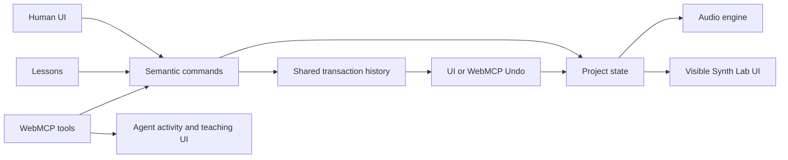

# Synth Lab WebMCP Guide

**Implementation audited:** 2026-08-09  
**Tool count:** 15  
**Status:** experimental proof of concept

Synth Lab uses the imperative WebMCP API to expose its musical controls as
structured tools. An agent can read the current project, edit patterns and
synth patches, control playback, point at teaching controls, and undo changes.
The tools operate on the visible project in the open browser tab; they are not a
remote API or a second copy of project state.

WebMCP is a progressive enhancement. Synth Lab, including its human UI, audio,
lessons, persistence, and undo, works normally when WebMCP is unavailable.

## Architecture

WebMCP is a thin adapter over the same semantic command layer used by the human
interface and lessons. It does not click DOM elements and does not mutate Tone
nodes as a parallel control system (except for the deliberately temporary,
non-persistent `audition_change` tool).



The main implementation entry points are:

- `src/synth-lab/SynthLabApp.tsx`: calls `registerWebMcpTools()` after the user
  starts audio.
- `src/synth-lab/webmcp/registerTools.ts`: feature detection, schemas, tool
  registration, execution, and result formatting.
- `src/synth-lab/state/commands.ts`: validation and all persistent project
  mutations.
- `src/synth-lab/webmcp/agentLog.ts`: agent action bookkeeping and displayable
  before/after changes.
- `src/synth-lab/state/history.ts` and `undoActions.ts`: shared transaction
  history, Undo/Redo, and restoration receipts.
- `src/synth-lab/components/AgentActionCard.tsx`, `Transport.tsx`, and
  `TrackEditor.tsx`: activity cards, activity count, changed-control treatment,
  Hear Before/After, and Undo UI.

## Requirements and setup

### Synth Lab requirements

1. Install dependencies and start the app:

   ```sh
   npm install
   npm run dev
   ```

2. Open `http://localhost:3000/synth-lab`.
3. Press **Start Synth Lab** (or **Skip to free play**). Tool registration is
   intentionally deferred until this audio-init interaction completes.
4. Keep the Synth Lab tab open. Tool callbacks execute in that page's browsing
   context.

No API key, WebMCP server, or Synth Lab environment variable is required.

### Experimental WebMCP/platform requirements

WebMCP remains an experimental proposed web standard. According to the current
[Chrome WebMCP documentation](https://developer.chrome.com/docs/ai/webmcp), the
Chrome implementation requires Chrome 149 or later and one of:

- **Local development:** enable
  `chrome://flags/#enable-webmcp-testing`, then relaunch Chrome.
- **Hosted review:** enroll the deployed origin in the WebMCP origin trial and
  deliver its trial token. Origin trials enable the feature for qualifying
  visitors without asking each reviewer to toggle a flag.

The document must also be origin-isolated. WebMCP is disabled if the page opts
out of origin isolation by enabling `document.domain` (for example,
`Origin-Agent-Cluster: ?0`). The `tools` Permissions Policy defaults to `self`,
so a top-level page and same-origin frames are allowed. A cross-origin iframe
would additionally need `allow="tools"`; Synth Lab does not use such an iframe.

Confirm the provider API in DevTools:

```js
"modelContext" in document
document.modelContext
```

The first expression should be `true`. Synth Lab prefers the current
`document.modelContext` API and retains a fallback for the deprecated
`navigator.modelContext` shape.

The browser API provides a tool provider, not necessarily an agent UI. For a
portable review workflow, Chrome's documentation recommends the
[Model Context Tool Inspector Extension](https://developer.chrome.com/docs/ai/webmcp#imitate_agent_chat_with_the_inspector_extension),
which can observe registrations, list schemas, invoke tools manually, inspect
results, and imitate natural-language agent selection. Do not assume another
agent/client can consume WebMCP unless that integration has been verified.

When WebMCP is unsupported, `registerWebMcpTools()` returns without registering
anything. No agent status, card, error, or disabled product state appears.

## Registration and call behavior

`getModelContext()` checks `document.modelContext`, then the deprecated
`navigator.modelContext`. `registerWebMcpTools()` registers all 15 tools once
per loaded adapter module. Every registered callback sets transient agent
status to `working` while it executes and back to `connected` afterward.

Every result uses WebMCP text content:

```json
{
  "content": [
    { "type": "text", "text": "{\"ok\":true}" }
  ]
}
```

The inner text is JSON. Read tools return state objects. Successful write tools
usually return `{ "ok": true }` plus the affected track snapshot and current
tempo. Validation failures return `{ "ok": false, "error": "..." }`; command
failures also include `"hint": "Nothing was changed."`. The adapter does not
throw expected validation errors at the agent.

### History and agent activity

The write tools call `dispatch(..., "agent")` or `dispatchBatch(...,
"agent", label)`. The origin is stored on the same inverse-patch transaction
used for human changes.

- One single-parameter tool call creates at most one transaction.
- A pattern array or multi-field patch is one transaction, so one Undo reverses
  the entire call.
- A batch validates command-by-command. If any command fails, the project rolls
  back to its pre-call state and no transaction is recorded.
- An idempotent set can succeed with no transaction because the requested value
  already matches the project.
- `play`, `stop`, selection, focus, coach messages, reads, and auditions are not
  project-history entries.

Mutating tools wrapped by `runMutating()` create an `AgentAction`: `working`
while executing, then `applied` or `error`. Track-specific actions select that
track and show an Agent Action Card with formatted changes and the supplied
`reason`. Synth patch cards support hold-to-**Hear Before**, **Hear After**, and
**Undo**. Card Undo is enabled only while that transaction is at the top of the
shared stack; keyboard Undo or `undo_last_change` can walk backward through
later changes. The transport also exposes an agent-activity count/history list.

`set_tempo` creates activity with no track, so it appears in the project-level
activity list rather than a track editor card. Read-only and transient UI tools
do not create `AgentAction` entries.

## Tool reference

All step indices are zero-based. The fixed loop has 32 sixteenth-note steps:
`0–15` are bar 1 and `16–31` are bar 2. Tracks are `drums`, `bass`, `pads`, and
`lead`; only `bass`, `pads`, and `lead` have synth patches.

### `get_project_state` — read

Returns tempo, master level, transport status, selected track, lesson state,
and all tracks with patterns, raw patches, and formatted parameter values.

```json
{}
```

Expected result: a complete current project snapshot. This tool is annotated
with `readOnlyHint: true` and has no history or UI side effects.

### `get_track_state` — read

Reads one track.

```json
{ "track": "bass" }
```

Expected result: `{id, muted, level, pattern, patch, formattedParams}`. An
unknown track returns `{ "ok": false, "error": "Unknown track." }`. This tool
also has `readOnlyHint: true`.

### `set_tempo` — write

Calls the `setTempo` command.

```json
{ "bpm": 112, "reason": "A little more forward motion" }
```

Tempo is rounded and clamped to 60–180 BPM. A non-number fails. The change is
undoable; playback continues at the new project tempo.

### `set_pattern` — write

Calls a batch of `setDrumStep` commands.

```json
{
  "steps": [
    { "lane": "kick", "step": 0, "value": "accent" },
    { "lane": "snare", "step": 4, "value": "on" },
    { "lane": "hat", "step": 16, "value": "on" }
  ],
  "reason": "A clear two-bar backbeat"
}
```

Lanes are `kick|snare|hat|perc`; values are `off|on|accent`. `steps` must be a
non-empty array. Invalid lanes, values, or indices roll back the whole batch.
All supplied edits undo together.

### `set_notes` — write

Calls a batch of `setStepNote` commands for bass or lead.

```json
{
  "track": "bass",
  "notes": [
    { "step": 0, "row": 0 },
    { "step": 4, "row": 2 },
    { "step": 8, "row": null }
  ],
  "reason": "A simple C-minor bass phrase"
}
```

`row` is a C-minor scale row `0–7`; `null` clears that step. Only `bass` and
`lead` are accepted. The state model enforces one note per step. The list must
be non-empty, and one invalid item rolls back the batch.

### `set_chords` — write

Calls a batch of `setStepChord` commands for pads.

```json
{
  "chords": [
    { "step": 0, "chord": "Cm" },
    { "step": 8, "chord": "Ab" },
    { "step": 16, "chord": "Eb" },
    { "step": 24, "chord": "Fm" }
  ],
  "reason": "One chord every half bar"
}
```

Chord values are `Cm|Ab|Eb|Fm` or `null` to clear. A chord start holds until
the next start, including across the bar boundary. The list must be non-empty;
the entire list is one undoable transaction.

### `set_synth_parameter` — write

Calls `setSynthParam` for one numeric parameter.

```json
{
  "track": "bass",
  "parameter": "cutoffHz",
  "value": 900,
  "reason": "Lower cutoff makes the bass darker"
}
```

Tracks: `bass|pads|lead`. Parameters and command-layer ranges are:

| Parameter | Meaning | Range |
| --- | --- | --- |
| `cutoffHz` | low-pass brightness | 100–8000 Hz |
| `resonance` | filter sharpness | 0–1 |
| `attack` | amp attack | 0.001–2 s |
| `decay` | amp decay | 0.01–2 s |
| `sustain` | amp sustain | 0–1 |
| `release` | amp release | 0.01–4 s |
| `filterEnvAmount` | filter sweep | 0–4 octaves |
| `octaveOffset` | register offset | −1, 0, or 1 |

Finite out-of-range values are clamped. Unknown parameters and non-numbers
fail without changing state.

### `apply_synth_patch` — write

Calls `applyPatch` to change several fields as one transaction.

```json
{
  "track": "bass",
  "patch": {
    "waveform": "square",
    "cutoffHz": 1200,
    "filterEnvAmount": 1.5,
    "ampEnv": { "attack": 0.01, "decay": 0.18, "sustain": 0.25 }
  },
  "reason": "A shorter, pluckier bass with a hollow square wave"
}
```

Patch fields are `waveform`, `cutoffHz`, `resonance`, `filterEnvAmount`,
`octaveOffset`, `voices`, and nested `ampEnv` (`attack`, `decay`, `sustain`,
`release`). Waveforms are `sine|triangle|sawtooth|square`; voices are `1|2|4`.
Numeric values use the ranges above. Invalid supported values handled by the
command layer fail the call; valid multi-field edits undo together. Callers
should follow the declared schema rather than sending undeclared fields.

### `play` — transient control

Starts the shared Tone transport through the `play` command.

```json
{}
```

The user must have initialized audio first. Otherwise the result tells the
agent to ask the user to press Start. Playback is not a history entry.

### `stop` — transient control

Stops the loop through the `stop` command.

```json
{}
```

Returns `{ "ok": true, "transportStatus": "idle" }`. It is safe before audio
initialization and is not a history entry.

### `audition_change` — transient audio

Applies temporary patch values directly to the existing engine, then restores
the stored patch automatically.

```json
{
  "track": "pads",
  "patch": { "waveform": "sawtooth", "cutoffHz": 4200 },
  "durationMs": 3000
}
```

Audio must already be initialized and the target must be a synth track. The
duration defaults to 2000 ms and is clamped to 250–8000 ms. No project state,
persistence, AgentAction, or history entry is created.

### `focus_control` — transient UI

Selects a synth track and highlights one control, optionally adding teaching
copy.

```json
{
  "track": "bass",
  "parameter": "cutoffHz",
  "conceptTitle": "Brightness",
  "conceptBody": "A lower low-pass cutoff removes upper harmonics."
}
```

The parameter can be any numeric parameter listed above, `waveform`, or
`voices`. Unknown controls fail. This affects transient UI only and is not
undoable project history.

### `present_coach_message` — transient UI

Shows teaching text in the coach/lesson surface.

```json
{ "message": "The darker sound comes from filtering out upper harmonics." }
```

An empty message fails. The message is not persisted or added to history.

### `undo_last_change` — history control

Calls the same `performUndo()` used by keyboard and Agent Action Card Undo.

```json
{}
```

It undoes the top transaction regardless of whether its origin is user,
lesson, or agent, then shows the normal restoration receipt. An empty stack
returns `{ "ok": false, "error": "Nothing to undo." }`.

### `reset_track` — write

Calls `resetTrackPattern` or `resetPatch`.

```json
{ "track": "lead", "scope": "pattern", "reason": "Return to the starter phrase" }
```

`scope` is `pattern|patch`. Pattern reset works for all tracks; patch reset is
synth-only and returns `Drums have no patch.` for drums. The reset is one
undoable transaction.

## Using Synth Lab with an agent

1. Open Synth Lab in a WebMCP-enabled, agent-capable browser environment.
2. Press **Start Synth Lab** so audio starts and the tools register.
3. Use the browser/client's tool inspector to confirm the 15 tools are visible.
4. Ask for a musical or teaching change in natural language.
5. Let the agent read state first when its request depends on current values.
6. The agent invokes one or more semantic tools; watch the normal controls,
   pattern grid, transport, or teaching UI update.
7. Inspect the Agent Action Card and its reason. For synth changes, compare
   **Hear Before** and **Hear After**.
8. Use card Undo, keyboard Undo, or `undo_last_change` to reverse the latest
   transaction.

Agent discovery and natural-language tool selection are client capabilities,
not supplied by Synth Lab itself.

## Demo scenarios

### 1. Pluckier bass

> Make the bass more plucky and explain what you changed.

Expected: the agent reads the bass, calls `apply_synth_patch` with a shorter
envelope (and a reason), and optionally calls `focus_control` or
`present_coach_message`. The Bass controls update together, one Agent Action
Card explains the change, and one Undo restores the whole patch.

### 2. Darker bass

> Make the bass darker, but keep the notes unchanged.

Expected: `set_synth_parameter` lowers `cutoffHz`; the note grid is unchanged.
The Brightness control receives the agent-changed treatment.

### 3. Brighter pad waveform

> Change the pads to a brighter waveform and tell me why it sounds brighter.

Expected: `apply_synth_patch` chooses `sawtooth` or `square` and supplies a
reason; teaching UI may be added through `focus_control` or
`present_coach_message`. The waveform control visibly changes.

### 4. Two-bar bass phrase

> Add a simple C-minor bass phrase in both bars, leaving some space.

Expected: `set_notes` writes rows at selected steps in both `0–15` and `16–31`.
The whole list is one transaction and one Undo restores every touched step.

### 5. Explain the current patch

> Explain why the current lead patch sounds the way it does. Don't change it.

Expected: `get_track_state` reads the lead, followed optionally by
`focus_control` and `present_coach_message`. No project transaction or changed
parameter card should appear.

## Testing and verification

### Automated coverage

Run:

```sh
npm test -- --run src/synth-lab/webmcp/__tests__/registerTools.test.ts
```

The Node/Vitest harness installs a fake `document.modelContext`, captures
registered tools, and calls their `execute` functions. It currently verifies:

- the semantic pattern/read surface registers;
- tool descriptions and state cover all 32 steps/two bars;
- drum, note, and chord mutations reach project state;
- multi-step pattern operations reach state through the batch command path;
- invalid out-of-range edits change nothing;
- shared-stack undo reverses an agent edit;
- track reset restores the two-bar default;
- project read and tempo mutation use the current 96 BPM default.

Other state/component tests cover command validation, transaction grouping,
agent change rendering, envelope before/after display, and shared Undo behavior.
The harness does **not** prove Chrome API compatibility, tool discovery by a
real agent, natural-language tool selection, or browser-agent interoperability.

### Manual POC verification

1. Enable WebMCP, open `/synth-lab`, and check
   `"modelContext" in document` in DevTools.
2. Open the inspector before pressing Start if you want to observe registration.
3. Press Start; confirm exactly 15 Synth Lab tools appear.
4. Manually invoke `get_track_state` with `{ "track": "bass" }` and inspect the
   decoded JSON result.
5. Invoke `set_synth_parameter` with a visibly different bass `cutoffHz`; verify
   the slider, formatted value, audio character, activity count, and card.
6. Invoke `apply_synth_patch` with two or more changed fields. Press the card's
   Undo once and verify all fields return together. Reapply, make a later human
   edit, and verify card Undo is disabled until the later transaction is undone.
7. Invoke an invalid step (`32`) and verify `{ok:false}` plus no project change.

## Troubleshooting

### `document.modelContext` is missing

- Confirm Chrome 149+.
- For localhost, enable `chrome://flags/#enable-webmcp-testing` and relaunch.
- For a hosted origin, confirm a valid WebMCP origin-trial token is delivered.
- Confirm the document is origin-isolated and does not enable
  `document.domain`/`Origin-Agent-Cluster: ?0`.
- If embedded cross-origin, confirm the iframe has `allow="tools"`.

### The provider exists but no tools are registered

Press **Start Synth Lab** first. Registration happens only after audio startup
succeeds. Then inspect the top-level Synth Lab page, not an unrelated frame.

### Audio is not initialized

`play` and `audition_change` deliberately refuse to bypass browser autoplay
policy. The human must press Start. On iPhone, also check Ring/Silent and output
volume; iOS can report Web Audio as running while Silent Mode mutes it.

### Invalid parameters or “Nothing was changed”

Read current state and compare the tool's enum/range rules above. Pattern batch
validation is atomic: one invalid item rejects the entire batch. Command errors
include the hint `Nothing was changed.` An idempotent write can instead return
success with an empty change list because the requested value already exists.

### Stale tools during development

Do a full page refresh after changing tool definitions. The adapter has a
module-level `registered` guard, so hot-module replacement is not a reliable
registration lifecycle test.

### Registration failure is silent

The adapter intentionally catches registration errors so experimental API
changes cannot break Synth Lab. If the provider exists but the inspector sees
no tools, check the browser console/API version, origin isolation, permissions
policy, and trial/flag configuration.

## Current limitations and audit findings

- WebMCP and Chrome's agent/inspector tooling remain experimental and can change.
- The page must remain open; these are in-page tools, not a headless MCP server.
- Synth Lab does not supply or authenticate an agent client.
- Tool outputs are JSON serialized into text content; there is no declared
  `outputSchema`.
- Only the two read tools carry `readOnlyHint`; transient non-project tools do
  not currently add annotations.
- Registration has a module-level duplicate guard but no explicit
  `AbortController` unregistration on App Router exit. Tools therefore live for
  the current document/module lifetime. Full navigation or refresh clears them.
- The current WebMCP draft shows asynchronous `registerTool()` plus an abort
  signal for lifecycle cleanup. Synth Lab calls registration synchronously and
  catches only synchronous throws, so a rejected registration promise may not
  be reflected in its UI. This does not affect the normal successful demo path,
  but should be hardened before treating the POC as production integration.
- The automated harness covers core pattern, read, tempo, reset, and undo paths,
  but does not invoke every one of the 15 tools. Manual inspector verification
  remains required for a portfolio demo.

No implementation behavior was changed during this documentation audit. The
POC is suitable for a controlled Chrome 149+ demo after manual tool discovery
and mutation verification. It should not yet be described as production-ready.

### Why WebMCP is used here

The agent manipulates the same instrument as the human through semantic musical
commands rather than brittle DOM clicks. Changes stay visible, editable, and
audible, and persistent agent edits participate in normal application history.
Synth Lab remains fully functional without WebMCP.
